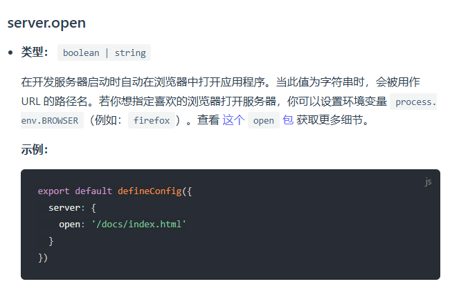
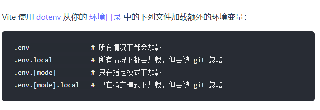
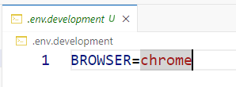
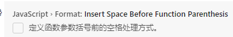

# vue3-project

自用的vue3初始化项目框架

git@github.com:ist11/vue3-project.git

## ide套件

[VSCode](https://code.visualstudio.com/) + [Vue - Official](https://marketplace.visualstudio.com/items?itemName=Vue.volar) (and disable Vetur).

## 初始化

先修改 **文件夹名称** 和 **package.json的项目名** 为你自己的项目名称

```sh
npm install
```

## 开发环境运行

```sh
npm run dev
```

## 打包项目

```sh
npm run build
```

## 语法检查 [ESLint](https://eslint.org/)

```sh
npm run lint
```


## 修改为自己的远程源


`git remote -v` 查看远程源列表

```bash
git remote -v
```

`git remote remove <远程源名称>` 删除指定的远程源，这里是origin

```bash
git remote remove origin
```

选择创建好的空仓库，提交代码（这个代码片段在创建仓库后会提供，需要自行copy）

```bash
git remote add <远程源名称> <仓库链接> 
git branch -M <分支名称，一般为main>
git push -u <远程源名称> <分支名称，一般为main>
```


## 设置开发环境默认浏览器

[开发环境设置默认行为](https://www.vitejs.net/config/index.html#server-open)



在`vite.config.js` 中进行了以下设置：

```js
export default defineConfig({
  ...
  server: {
    host: 'localhost', //自定义监听的ip地址
    port: '5173', //指定端口
    open: true, //启动服务时自动打开浏览器
    https: false //不使用https
  }
})
```


[指定哪些环境下使用什么变量](https://www.vitejs.net/guide/env-and-mode.html#env-files)



在`.env.development` 中设置了默认启动的浏览器为chrome

> 24.9.6 vscode在ctrl+单击打开链接时会打开两个浏览器，不知道原因



添加.local后缀可以让git忽略这个配置文件


> Vite 内置了三种常见的模式（mode），分别是：
>
> 1. **`development`** - 开发模式：默认通过 `vite` 启动时使用。
> 2. **`production`** - 生产模式：默认通过 `vite build` 启动时使用。
> 3. **`test`** - 测试模式：通常在测试环境下使用。
>
> 你可以通过以下几种方式指定模式：
>
> ### 1. 通过命令行参数指定模式
>
> 当启动 Vite 时，可以使用 `--mode` 选项指定模式，例如：
>
> ```bash
> vite --mode development
> vite build --mode production
> ```
>
> ### 2. 通过 `VITE_ENV` 环境变量
> 你还可以通过设置 `VITE_ENV` 环境变量来指定模式，例如：
>
> ```bash
> VITE_ENV=production vite build
> ```
>
> ### `.env` 文件的优先级
> Vite 会根据不同模式自动加载相应的 `.env` 文件，这些文件会以不同的优先级进行加载：
>
> 1. `.env` - 所有模式下都会加载。
> 2. `.env.local` - 所有模式下加载，但会被 Git 忽略。
> 3. `.env.[mode]` - 仅在特定模式下加载（例如：`.env.production`）。
> 4. `.env.[mode].local` - 仅在特定模式下加载，但会被 Git 忽略（例如：`.env.production.local`）。
>
> ### 自定义模式
> 除了 `development`、`production` 和 `test` 外，你还可以定义自定义模式。例如，创建一个 `.env.staging` 文件，然后通过以下方式使用该模式：
>
> ```bash
> vite --mode staging
> ```
>
> ### 使用模式的场景
> - **开发模式 (`development`)**：使用本地开发环境的配置，如调试工具和开发服务器。
> - **生产模式 (`production`)**：用于正式上线的环境，通常启用压缩和性能优化。
> - **测试模式 (`test`)**：适用于测试环境，通常会使用模拟的后端或数据库。
>
> 通过不同的模式，Vite 可以加载不同的环境变量配置，实现针对不同环境的定制化处理。

> 是的，Vite 可以像 Vue CLI 一样配置监听 `localhost` 和本机局域网 IP。你可以通过设置 Vite 的 `server.host` 和 `server.watch` 选项来实现这一点。
>
> ### 配置方法
>
> 在 `vite.config.js` 中，你可以配置如下选项：
>
> ```js
> export default {
>   server: {
>     host: true, // 设置为 true 来监听本机的局域网 IP
>     port: 3000, // 端口号
>     open: true, // 自动打开浏览器
>   }
> }
> ```
>
> ### 说明
>
> - `host: true`：此配置会让 Vite 监听 `localhost` 和本机的局域网 IP，和 Vue CLI 的默认行为一致。这样你可以通过 `localhost` 或者局域网 IP 来访问开发服务器。
> - `port`：配置端口。
> - `open`：自动在浏览器中打开开发服务器页面。
>
> 这样配置后，Vite 会同时监听本机的 `localhost` 和局域网 IP，你可以在浏览器中通过两者之一来访问项目。
>
> 如果你需要更细粒度的控制，比如仅监听特定 IP，你可以将 `host` 设置为特定的 IP 地址，例如 `host: '192.168.1.100'` 这种形式。

## 已经额外安装的插件

1.@types/node

`@types/node` 是一个 TypeScript 类型定义包，为 Node.js 的核心模块提供 TypeScript 类型声明。它让 TypeScript 编译器了解 Node.js 的 API 及其类型，从而提供类型检查和自动补全功能。

> vscode要求加的,加了不会在某些情况下报路径错误

```bash
npm install -D @types/node
```

2.eslint-import-resolver-alias

设置eslint允许路径别名

```bash
npm i eslint-import-resolver-alias -D
```


## VSCode的设置项

> 
>
> false:阻止在函数名与括号之间添加空格

```
"javascript.format.insertSpaceBeforeFunctionParenthesis": false
```


## 参考

[vite+vue3实现低版本浏览器兼容的解决方案](https://juejin.cn/post/7356889912127864832) 

vue3向下只能支持到ES6（ECMAScript 2015）,有支持es6的需求可以参考

如果需要支持es5及更早的规范(ie7-11)只能使用vue2.x

[npm查看已安装的包](https://blog.csdn.net/jiaoqi6132/article/details/130146145)

参考了黑马的人力资源项目创建的目录，添加了.gitkeep保证目录上传，拉取后自行删除

```bash
├── src                        # 源代码目录
│   ├── api                    # 所有请求
│   ├── assets                 # 主题 字体等静态资源
│   ├── components             # 全局公用组件
│   ├── icons                  # 项目所有 svg icons
│   ├── layout                 # 全局 layout
│   ├── router                 # 路由
│   ├── store                  # 全局 store管理
│   ├── styles                 # 全局样式
│   ├── utils                  # 全局公用方法
│   ├── views                  # views 所有页面
│   ├── App.vue                # 入口页面
│   ├── main.js                # 入口文件 加载组件 初始化等
│   └── permission.js          # 权限管理
│   └── settings.js            # 配置文件

```

> settings.js导出网站基础配置，包括：网站标题、固定header、显示logo
> permission.js(权限)，主要负责路由导航守卫
>
> 这里只提供空文件,根据实际情况编写内容

## 说明

可能需要根据情况添加内容,创建项目的时候没有添加ts支持和jsx支持
